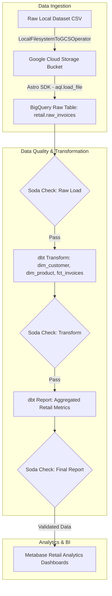

# 🛒 RetailPulse-DataOps-Pipeline
### End-to-End Enterprise Data Pipeline with Apache Airflow, Google BigQuery, dbt, & Soda Core


---

## 📌 Executive Overview

**RetailPulse-DataOps-Pipeline** is a production-grade, automated ELT (Extract, Load, Transform) data engineering pipeline built to process large-scale retail analytics data. It automates raw dataset ingestion into **Google Cloud Storage (GCS)**, streams data into **Google BigQuery**, enforces automated **Soda Core** data quality gates at every stage, executes modular **dbt** transformations via **Astronomer Cosmos**, and feeds clean data models into **Metabase** dashboards.

---

## 🏗️ Pipeline Architecture & Workflow



---

## ✨ Key Features

- **Automated Data Staging**: Seamlessly uploads local raw datasets into Google Cloud Storage.
- **Astro SDK Ingestion**: Leverages `astro-sdk-python` for scalable, boilerplate-free data loading into BigQuery.
- **Dynamic dbt Integration**: Uses **Astronomer Cosmos** (`astronomer-cosmos`) to render dbt SQL models as native Airflow DAG Task Groups.
- **Automated Quality Gates**: Implements **Soda Core** checks after raw load, transformation, and reporting stages to halt corrupt data downstream.
- **Virtual Environment Isolation**: Keeps dbt (`dbt_venv`) and Soda (`soda_venv`) dependencies completely isolated inside Docker to prevent dependency hell.
- **Modular Data Warehousing**: Implements standard Kimball dimensional modeling (`dim_customer`, `dim_product`, `fct_invoices`).

---

## 📂 Project Directory Structure

```text
RetailPulse-DataOps-Pipeline/
├── dags/
│   └── retail.py                    # Main Airflow DAG defining pipeline workflow
├── include/
│   ├── dataset/
│   │   └── online_retail.csv        # Raw transaction dataset
│   ├── dbt/                         # dbt analytics project
│   │   ├── models/                  # SQL models (sources, transform, report)
│   │   ├── cosmos_config.py         # Cosmos Airflow integration settings
│   │   └── profiles.yml             # dbt profile settings
│   └── soda/                        # Soda Core data quality checks
│       ├── checks/                  # YAML files with data quality assertions
│       ├── check_function.py        # Python function for executing Soda scans
│       └── configuration.yml        # Soda connection configs
├── Dockerfile                       # Custom Astro Runtime Docker image with venvs
├── requirements.txt                 # Airflow provider packages & dependencies
├── packages.txt                     # System-level dependencies
└── README.md                        # Documentation
```

---

## 🚀 Getting Started & Local Setup

### 1. Prerequisites
- [Docker Desktop](https://www.docker.com/) installed & running.
- [Astro CLI](https://docs.astronomer.io/astro/cli/install-cli) installed.
- A Google Cloud Platform (GCP) Account with BigQuery & GCS enabled.

### 2. Clone the Repository
```bash
git clone https://github.com/nachiket0987/RetailPulse-DataOps-Pipeline.git
cd RetailPulse-DataOps-Pipeline
```

### 3. Launch Local Airflow Environment
Run the following command to build and launch the Docker containers (Airflow Webserver, Scheduler, Triggerer, Postgres DB):
```bash
astro dev start
```

Verify that all containers are active:
```bash
docker ps
```

### 4. Access Airflow UI & Setup GCP Connection
1. Open [http://localhost:8080](http://localhost:8080) in your browser.
2. Log in with credentials: `admin` / `admin`.
3. Go to **Admin > Connections** and add a connection named `gcp`:
   - **Connection Id**: `gcp`
   - **Connection Type**: `Google Cloud`
   - Provide your GCP **Project ID** and **Keyfile JSON**.

---

## 📊 Analytics & Data Models

| Model | Type | Description |
| :--- | :--- | :--- |
| `raw_invoices` | Raw Table | Direct ingestion of raw transactional invoice records |
| `dim_customer` | Dimension | Cleaned customer profile & location attributes |
| `dim_product` | Dimension | Stock code, description, and unit price dimensions |
| `fct_invoices` | Fact Table | Invoice transactions, quantities, revenue, and date keys |
| `report_country_invoices` | Aggregate Report | Revenue and order volume sliced by country |
| `report_product_invoices` | Aggregate Report | Top-selling retail products performance |

---

## 👨‍💻 Maintainer & Author

**Nachiket Gadilohar**
- 📧 **Email**: [nachiketlohar0306@gmail.com](mailto:nachiketlohar0306@gmail.com)
- 🐙 **GitHub**: [@nachiket0987](https://github.com/nachiket0987)
- 💼 **LinkedIn**: [Nachiket Gadilohar Profile](https://linkedin.com/in/nachiket-gadilohar-profile/)
